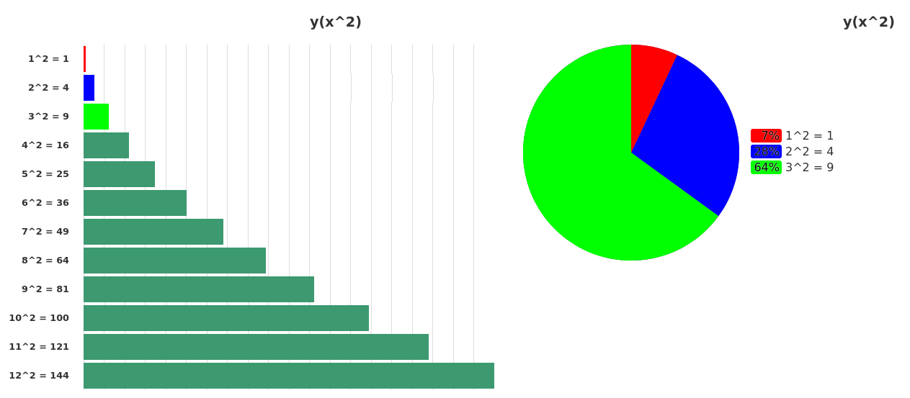

<div style="text-align: right">Piotr Zmyślony, nr albumu 268833</div>

# <center> Język do generowania wizualizacji </center>
<center> Dokumentacja końcowa </center>

## Opis funkcjonalny
Język służy do generowania wykresów kołowych i słupkowych w formie pojedynczego pliku HTML i CSS, z obsługą natywną typu danych w formie JSON. Przykładowy kod i wynik działania programu:
```
red= #ff0000;
blue = #0000ff;
green = #00ff00;

a = [<'1^2 = 1', 1, red>];
a += <'2^2 = 4', 4, blue>;
a += <'3^2 = 9', 9, green>;

for (i=4; i<13; i+=1) {
	a += <''+i+'^2 = '+i*i, i*i>;
}

bar(a, 'y(x^2)');
pie([a[0], a[1], a[2]], 'y(x^2)');
```


## Formalny opis gramatyki
Opis formalny gramatyki w notacji stosowanej przez ANTLR (która jest bardzo zbliżona do EBNF) zająłby ponad 3 strony, więc postanowiłem nie zamieszczać jej w dokumentacji końcowej – dostępna jest [tutaj](https://gitlab-stud.elka.pw.edu.pl/pzmyslon/graph-language/-/blob/main/src/glang.g4).

## Opis techniczny realizacji
Interpreter jest napisany w języku Python, testowany na wersjach 3.8 i 3.7 i Ubuntu.  Jest to język interpretowany, stosujący typowanie dynamiczne. Dodatkowo użyłem narzędzi:
- **tox** do automatyzacji budowania leksera i parsera oraz testowania,

i dodatkowo moduły pythonowe:
- **antlr4-python-runtime** żeby móć korzystać z antlr4,
- **pytest** do uruchamiania testów,
- **libsass** żeby użyć Sass zamiast czystego CSS,
- **pyinstaller** do generowania pojedynczego pliku wykonywalnego.

## Krótki przewodnik
### Instalacja
Żeby zbudować na własnej maszynie kompilator należy:
1. Zainstalować narzędzia: *tox*, *Java Runtime Environment*, *binutils* i *libc6*.
2. Uruchomić polecenie `tox` w folderze projektu - generacja parsera i leksera, testowanie i utworzenie pliku wykonywalnego.
3. W folderze *dist/* powinien znajdować się plik wykonywalny *glang*, który jest naszym kompilatorem.

### Używanie programu
Najprostsza wersja: `./glang -i <plik_wejściowy>`. Takie wywołanie generuje pliki HTML i CSS w tym samym katalogu co program *glang*. Można też podać dodatkowo argument `-o <katalog_wyjściowy>`.

### Język
#### Wbudowane typy danych
##### Wyrażenia logiczne
Mogą to być zwyczajne `true` i `false`, lub bardziej skomplikowane z użyciem formuł matematycznych, funkcji lub zmiennych. Oczywiście zastosowane funkcje i zmienne muszą zwracać wartości liczbowe lub logiczne. Każda wartość liczbowa inna niż `0` jest adekwatna `true`. Do grupowania wyrażeń logicznych stosuje się `(` i `)`, oraz `|` (lub) i `&` (i) do ich łączenia. Wyrażenia logiczne są interpretowane bezpośrednio do wartości `true` lub `false`.

np.: `0 & true`, `(5 > 2) | (a < 3)`, `return_something(a) & a <= calculate(a)`
##### Wyrażenia matematyczne
Język nie rozróżnia liczb całkowitych od rzeczywistych, wszystkie są obsługiwane jednakowo. Wyrażenia mogą zawierać dodatkowo zmienne i wywołania funkcji, oraz używają standardowego zestawu operatorów `+`, `-`, `*` i `/`. Wyrażenia matematyczne interpretowane są bezpośrednio do wartości liczbowej.

np.: `5`, `-12 * 1.23`, `funkcja(a, b, c) / 0.12 * (a + b - c)`
##### Ciągi znaków
Definiowane z użyciem cudzysłowów pojedynczych lub podwójnych, możliwa jest konkatenacja jednego ciągu z innym ciągiem lub wyrażeniem matematycznym przy użyciu operatora `+`.

np.: `'ala ma kota'`, `"ala ma " + x*5 + ' kotow, z czego jeden ma na imie "Mruczek"'`
##### Kolory
Kolory można definiować tylko przy użyciu znaku `#` i następujących po nim 6 symboli systemu heksadecymalnego.

np.: `#ff1234`, `#a3f2d9`
##### Data Point
Punkt danych zawierający informacje o wartościach *x* i *y* oraz opcjonalnie o kolorze punktu. Służy do rysowania wykresów typu *y(x)*. **Typ danych jest, ale jest na tą chwilę bezużyteczny, bo funkcja rysująca nie jest ukończona.**

np.: `<1, 15, #0f0f0f>` (x, y, kolor), `<-1, 0.5, czerwony>`(x, y, zmienna), `<-1, -15>` (x, y)

Dostęp do własności obiektu typu Data Point jest możliwy przez operator `.`: `point.x`, `point.y`, `point.color`. Dodatkowo dostęp do `point.color` można skrócić do `#point`.
##### Named Value
Zawiera opis, wartość oraz opcjonalnie kolor reprezentowanego obszaru. Obszar tłumaczy się na słupek w wykresie słupkowym lub odpowiednią część diagramu kołowego.

np.: `<'maly obszar', 0.5, #f0f0f0>` (opis, wartość, kolor), `<"duży obszar", 5>` (opis, wartość, zmienna), `<'jeszcze troche wiekszy', 5.5>` (opis, wartość)

Dostęp do własności obiektu typu Data Point jest możliwy przez operator `.`: `val.label`, `val.value`, `val.color`. Dodatkowo dostęp do `val.color` można skrócić do `#val`.
#### Zmienne
Zmienne nie są silnie typowane, w każdej chwili ich typ może zostać zmieniony przez użytkownika. Zasięgi zmiennych kontrolowane są przy pomocy znaczników `{` i `}` (na obecną chwilę jedynie możliwe dla funkcji, pętli i instrukcji warunkowych). Do zmiennej można przypisać dowolny typ wbudowany, wynik działania funkcji, listę bądź kolekcję typu JSON. Przykładowe przypisanie wartości do zmiennej wygląda następująco:
```
a = 5;
a = [jakis_ciag_znakow(), {'json_test': 15}];
```
##### Operatory
Na zmiennych niektórych typów można zastosować wybrane operatory:
- *wartość liczbowa* ***a*** (`+=`, `-=`, `/=`, `*=`) *wartość liczbowa* ***b*** - zmiennej **a** przypisujemy wartość **a** `+`/`-`/`/`/`*` wartość **b**
- *lista* `+=` *dowolna wartość* - dodanie wartości do listy
- *ciąg znaków* ***a*** `+` *ciąg znaków* ***b*** - zwraca połączenie ciągu **a** z **b**

#### Kolekcje
##### Lista
Lista działa i jest definiowana pythonowo - może pomieścić wartości dowolnego typu w kolejności dodania. Dodawanie elementu do listy realizowane jest przez operator `+=`, a dostęp do (n-1)-ego elementu listy przez operator `lista[n]`.

np.:
```
a = ['test'];
a += 5;
a += <12,-12>;
a[2] = #ff0000;
```
##### JSON
Definiowanie i dostęp do zagnieżdżonych obiektów wewnętrznych (zgodnie z konwencją formatu JSON, każdy *top-level* obiekt typu JSON musi być objęty nawiasami klamrowymi `{}`):
```
a = {"test": 15};
b = a.'test'
c = a."test"
```
Z racji tego, że nazwy obiektów zawartych w JSON-ie mogą posiadać (prawie) dowolne znaki, niezbędne jest stosowanie cudzysłowów, jak widać w powyższym przykładzie.

Dostęp do zagnieżdżonej tablicy:
```
a = {"test": [125, {"test": "abc"}]};
b = a."test"[2]."test";
```
#### Pętla for
Nic specjalnego, skonstruowana bardzo podobnie do języka C++, przykładowo:
```
b = 0;
for(a=0; a<=4; a+=1) {
    b += 1;
}
```
Po prześciu takiej pętli wartość *b* powinna wynosić 5.
#### Instrukcja warunkowa if
Również podobnie względem języka C++, na przykład:
```
a = true;
if (!a | true) {
    a = false;
}
```
Na koniec, *a* powinno być równe *false*.
#### Funkcje
##### Definiowanie i wywoływanie
Definicje funkcji **nie mogą** być zagnieżdżone w innych funkcjach, pętlach ani instrukcjach warunkowych - muszą znajdować się na "najwyższym poziomie" kodu. Funkcje mogą zwracać wartość przy użyciu słowa kluczowego `return`. Przykładowa definicja funkcji:
```
def test(a, b, c) {
    return a/b+c;
}
```
Wywołanie funkcji zakończy się sukcesem tylko przy podaniu odpowiedniej liczby argumentów, przykładowo:
```
z = test(1, 2, 3);
```
Funkcje można wywoływać z dowolnego miejsca w kodzie (również przed definicją funkcji) lub innej funkcji (tutaj wymagane jest aby funkcja wywoływana była zdefiniowana przed definicją funkcji z niej korzystającej).
##### Funkcje wbudowane
Funkcje wbudowane można przeładować definiując własne funkcje o tej samej nazwie (chociaż nie jest to zalecane).
###### *pie(list_of_named_values, title)*
Generuje wykres kołowy bazując na liście, która musi zawierać tylko Named Values, z tytułem *title* u góry.
###### *bar(list_of_names_values, title)*
Generuje wykres słupkowy bazując na liście, która musi zawierać tylko Named Values, z tytułem *title* u góry.
#### Błędy w kodzie
Błedy w kodzie komunikowane są na etapie działania leksera, parsera i podczas interpretacji kodu. Każdy błąd powoduje zakończenie kompilacji i żadne pliki wyjściowe nie są generowane (nawet jeśli by mogły bazując na części kodu która została napisana poprawnie).

W treści komunikatu zaznaczone jest w którym miejscu użytkownik popełnił błąd oraz informację o typie błędu, np.:
```
IllegalOperator: (1, 12): Illegal operation '-=' on variable 'a'(String)
```
